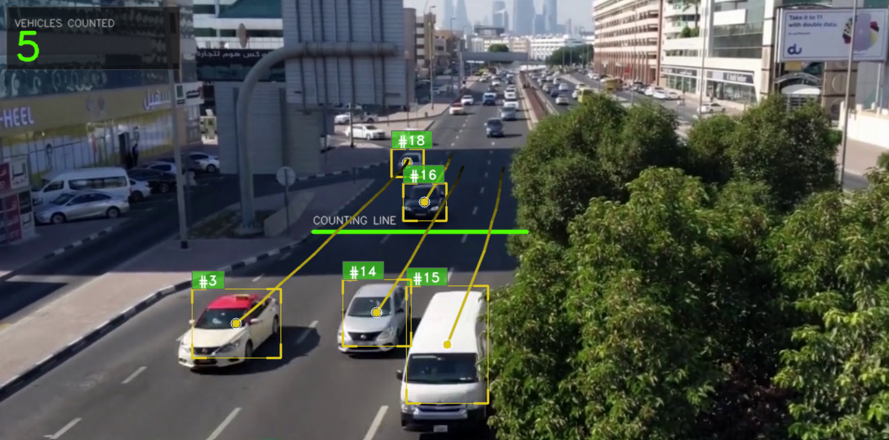
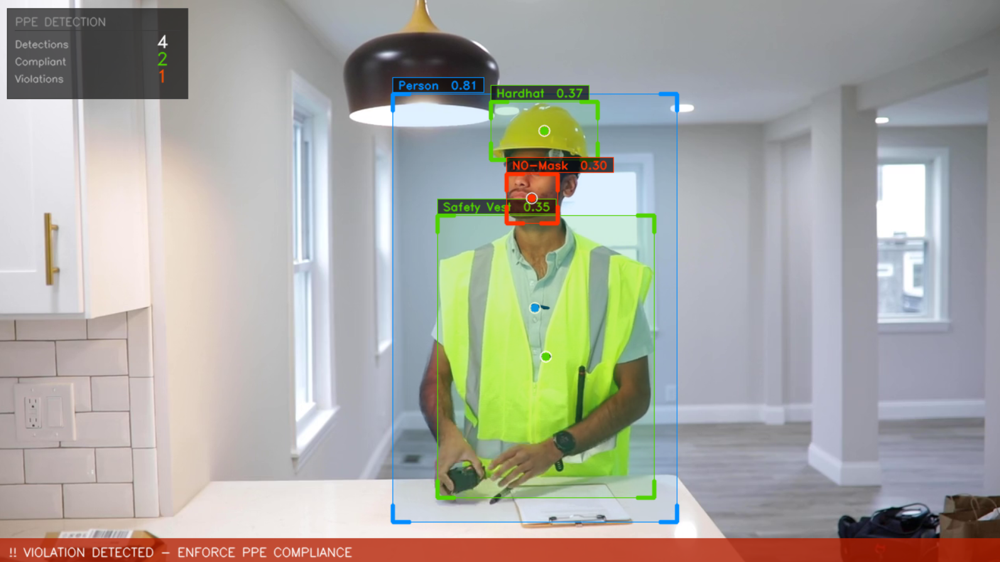

# YOLOv8 Object Detection & Tracking





This project contains Python scripts for real-time object detection and tracking using YOLOv8, OpenCV, and the SORT tracking algorithm. It also includes the ability to train and run custom YOLO models for specific use-cases, such as Personal Protective Equipment (PPE) compliance detection.

## Folder Structure
- `scripts/`: Contains Python scripts for detection, tracking, and training (e.g., `videos.py`, `trainedYOLOdetect.py`, `trainYOLO.ipynb`).
- `Images/`: Directory for input images.
- `Videos/`: Directory for input and output videos.
- `Weights/`: Directory for standard YOLOv8 model weights (e.g., `yolov8n.pt`).
- `Datasets/`: (Optional) Directory for your custom dataset files and configurations.
- `runs/`: Directory automatically generated by YOLO during training or inference, containing custom `best.pt` weights and plots.

## Setup

1. Install the required dependencies:
   ```bash
   pip install -r requirements.txt
   ```

2. Run the scripts from the `scripts` folder:
   - For basic vehicle tracking: `python scripts/YOLOcar-count.py`
   - For custom PPE detection: `python scripts/trainedYOLOdetect.py`
   
3. To train your own custom model:
   - Open and run the Jupyter notebook `scripts/trainYOLO.ipynb`.

## Custom Training (PPE Detection)
The newly added `trainYOLO.ipynb` allows you to fine-tune a YOLOv8 model on a custom construction safety dataset. The resulting weights (`best.pt`) are used by `trainedYOLOdetect.py` to identify whether workers are compliant with wearing safety gear (Hardhat, Safety Vest, Mask) and visualizes the results with a custom HUD and coloured bounding boxes.

## Acknowledgements
- The `sort.py` script is from **[Alex Bewley's SORT repository](https://github.com/abewley/sort)** for real-time tracking of multiple objects. It is licensed under the GPL-3.0 License.
- YOLOv8 by [Ultralytics](https://github.com/ultralytics/ultralytics).
- Custom Construction Safety Dataset sourced from [Roboflow](https://roboflow.com/).
